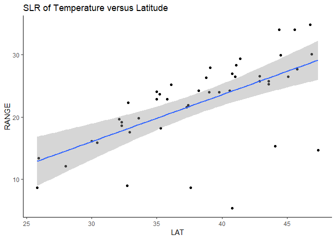
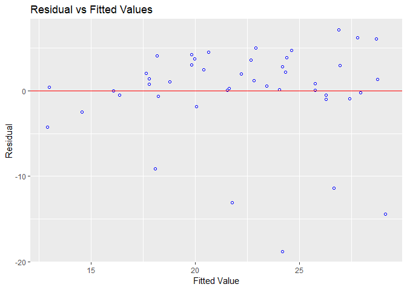
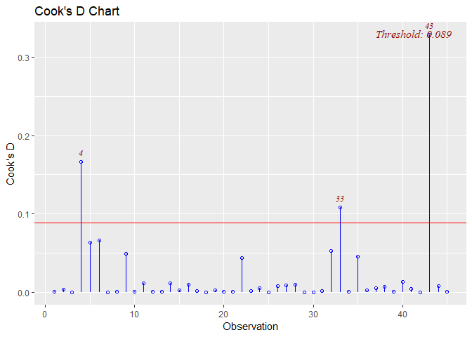
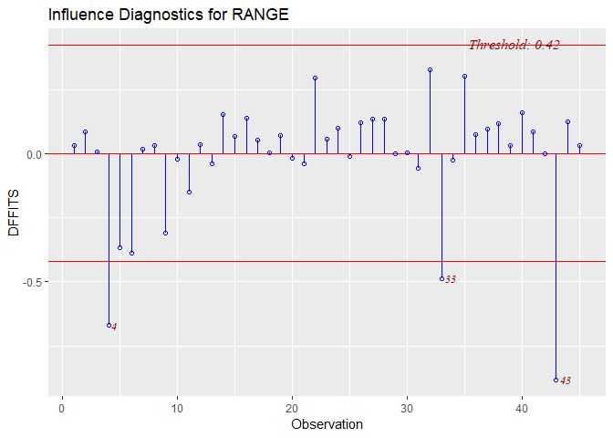
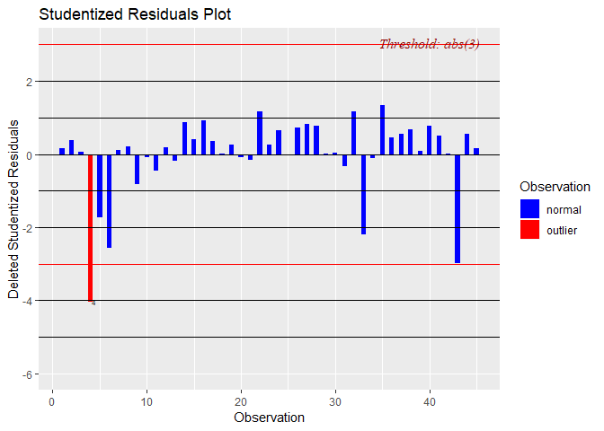
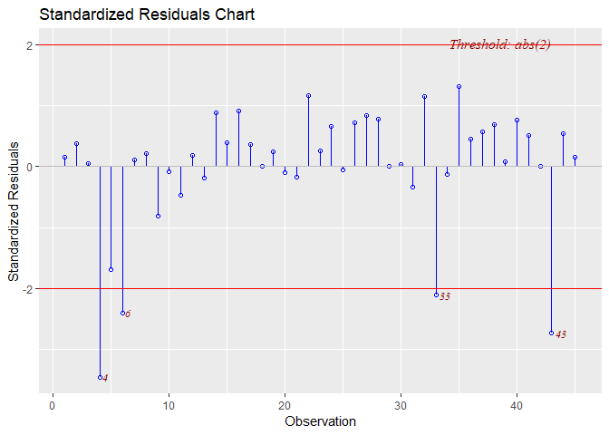

Lab3 Assignment
================
Somnath Mukherjee
Feb 7, 2019

### Lab set-up

``` r
#read input file
theData = read.table(here('lab3','data','data3.txt'), header = F, stringsAsFactors = T) #use here() function to specify path
colnames(theData)=c("CITY","STATE","LAT","RANGE")
```

The latitude (LAT) and the mean monthly range (RANGE), which is the difference between mean monthly maximum and minimum temperatures, are given for a selected set of US cities. The following program performs a SLR using RANGE as the dependent variable and LAT as the independent variable.

### Creating a Scatter Plot first

``` r
ggplot(data = theData,aes(x = LAT,y = RANGE))+
  geom_point()+
  ggtitle('Scatterplot of Temperature versus Latitude') +
  theme_classic()
```


### Fitting the SLR model

Based on the scatterplot produced above, we assume that an appriopriate regression model relating RANGE and LAT is the linear model given by
y = b0 + b1x + e
where y is the RANGE, x is the LAT, and e is a random error term that is normally distributed with the mean 0 and the unknown variance.
b0 is the estimate of the y-intercept and b1 is the estimate of the slope coeffient.

``` r
#fit the model
model1 <‐ lm(RANGE ~ LAT, data = theData)
summary(model1)
```

    ## 
    ## Call:
    ## lm(formula = RANGE ~ LAT, data = theData)
    ## 
    ## Residuals:
    ##      Min       1Q   Median       3Q      Max 
    ## -18.7823  -0.4865   0.8395   3.0765   7.1123 
    ## 
    ## Coefficients:
    ##             Estimate Std. Error t value Pr(>|t|)    
    ## (Intercept)  -6.4793     5.5481  -1.168    0.249    
    ## LAT           0.7515     0.1438   5.228 4.79e-06 ***
    ## ---
    ## Signif. codes:  0 '***' 0.001 '**' 0.01 '*' 0.05 '.' 0.1 ' ' 1
    ## 
    ## Residual standard error: 5.498 on 43 degrees of freedom
    ## Multiple R-squared:  0.3886, Adjusted R-squared:  0.3744 
    ## F-statistic: 27.33 on 1 and 43 DF,  p-value: 4.786e-06

The regression model is:
RANGE(predicted) = -6.47 + 0.751\*LAT

### Plot the regression line/model

``` r
ggplot(data = theData,aes(x = LAT,y = RANGE))+
  geom_point()+
  geom_smooth(method = lm)+
  ggtitle('SLR of Temperature versus Latitude') +
  theme_classic()
```



The model does not fit the data very well as we can see in the plot above there are a good number of regression outliers.

### 1. Is the normality assumption violated? State the name and the value of the statistic that you used to reach your conclusion.

``` r
ols_test_normality(model1)
```

    ## -----------------------------------------------
    ##        Test             Statistic       pvalue  
    ## -----------------------------------------------
    ## Shapiro-Wilk              0.7976         0.0000 
    ## Kolmogorov-Smirnov        0.2502         0.0057 
    ## Cramer-von Mises          2.7863         0.0000 
    ## Anderson-Darling          3.1553         0.0000 
    ## -----------------------------------------------

From Shapiro-Wilk test p-value is &lt; 0.05.Hence, the normality of the residual in not preserved.
Below is the distribution of fitted-vs-residual plot, which appearently shows non-homogenity.

``` r
ols_plot_resid_fit(model1)
```



### 2. Does there appear to be any possible influential observation. State the name and the value of the statistics that you used to reach your conclusion.

Below will list Hat Diag H, dffits and dfbetas. It also has cook’s d bar and cov.r. These statistics are usually used to detect possible outliers.
Astericks beside obs. denotes influential obs.

``` r
# Get ALL INFLUENCE MEASURES DISCUSSED (DFFITS,DFBETAS,COOKSD,HAT diag)
influence.measures(model1)
```

    ## Influence measures of
    ##   lm(formula = RANGE ~ LAT, data = theData) :
    ## 
    ##       dfb.1_   dfb.LAT    dffit cov.r   cook.d    hat inf
    ## 1   0.026392 -0.023305  0.03248 1.097 5.40e-04 0.0458    
    ## 2   0.069580 -0.061699  0.08464 1.093 3.65e-03 0.0474    
    ## 3   0.002106 -0.001012  0.00755 1.072 2.92e-05 0.0226    
    ## 4   0.187855 -0.280922 -0.67084 0.560 1.66e-01 0.0269   *
    ## 5  -0.289049  0.252898 -0.36524 0.954 6.37e-02 0.0427    
    ## 6  -0.095110  0.038608 -0.38731 0.803 6.65e-02 0.0224   *
    ## 7  -0.002108  0.004466  0.01626 1.073 1.35e-04 0.0240    
    ## 8   0.000126  0.004669  0.03245 1.070 5.38e-04 0.0227    
    ## 9  -0.298734  0.282598 -0.31116 1.163 4.88e-02 0.1269   *
    ## 10 -0.019976  0.018203 -0.02258 1.119 2.61e-04 0.0635    
    ## 11 -0.139515  0.130166 -0.14922 1.144 1.13e-02 0.0930   *
    ## 12  0.026925 -0.022949  0.03669 1.086 6.88e-04 0.0365    
    ## 13  0.021933 -0.026301 -0.03814 1.093 7.44e-04 0.0424    
    ## 14 -0.054779  0.075221  0.15263 1.041 1.17e-02 0.0294    
    ## 15 -0.020532  0.029699  0.06681 1.070 2.28e-03 0.0277    
    ## 16 -0.001859  0.022544  0.14018 1.031 9.86e-03 0.0228    
    ## 17  0.007723  0.000274  0.05412 1.065 1.49e-03 0.0222    
    ## 18  0.001531 -0.001402  0.00171 1.125 1.49e-06 0.0679    
    ## 19 -0.052798  0.059154  0.07065 1.129 2.55e-03 0.0743    
    ## 20  0.010814 -0.012967 -0.01880 1.094 1.81e-04 0.0424    
    ## 21  0.027334 -0.031509 -0.04080 1.108 8.52e-04 0.0550    
    ## 22 -0.205299  0.234446  0.29552 1.046 4.33e-02 0.0600    
    ## 23  0.046075 -0.040686  0.05671 1.095 1.64e-03 0.0458    
    ## 24  0.003852  0.011007  0.10039 1.050 5.11e-03 0.0225    
    ## 25  0.008058 -0.009171 -0.01145 1.117 6.71e-05 0.0620    
    ## 26 -0.038915  0.055472  0.12139 1.053 7.45e-03 0.0281    
    ## 27  0.063941 -0.045816  0.13417 1.040 9.07e-03 0.0252    
    ## 28  0.082978 -0.066140  0.13606 1.049 9.34e-03 0.0291    
    ## 29 -0.000740  0.000913  0.00143 1.089 1.05e-06 0.0375    
    ## 30 -0.001265  0.001970  0.00503 1.076 1.29e-05 0.0263    
    ## 31 -0.032962  0.025705 -0.05715 1.072 1.67e-03 0.0279    
    ## 32 -0.242094  0.271576  0.32549 1.062 5.26e-02 0.0731    
    ## 33  0.297134 -0.350808 -0.48667 0.882 1.09e-01 0.0463    
    ## 34 -0.019164  0.016682 -0.02457 1.093 3.09e-04 0.0412    
    ## 35 -0.190875  0.223549  0.30304 1.014 4.51e-02 0.0488    
    ## 36  0.038170 -0.028397  0.07394 1.066 2.79e-03 0.0261    
    ## 37  0.059484 -0.047413  0.09754 1.063 4.83e-03 0.0291    
    ## 38  0.068525 -0.053853  0.11652 1.055 6.87e-03 0.0283    
    ## 39  0.028959 -0.027380  0.03019 1.198 4.67e-04 0.1252   *
    ## 40  0.125570 -0.109591  0.15981 1.064 1.29e-02 0.0419    
    ## 41 -0.024006  0.035898  0.08573 1.064 3.74e-03 0.0269    
    ## 42  0.000393 -0.000201  0.00133 1.073 9.07e-07 0.0227    
    ## 43  0.673312 -0.749969 -0.88152 0.777 3.28e-01 0.0805   *
    ## 44 -0.078978  0.092266  0.12418 1.088 7.84e-03 0.0496    
    ## 45 -0.015729  0.019395  0.03038 1.088 4.72e-04 0.0375

Now going by each one of the measures separately:

*a) Cook’s d chart and analysis*

``` r
CkDchart=ols_plot_cooksd_chart(model1) # Chart
```



``` r
CkDchart$outliers 
```

    ## # A tibble: 3 x 2
    ##   observation cooks_distance
    ##         <int>          <dbl>
    ## 1           4          0.166
    ## 2          33          0.109
    ## 3          43          0.328

Above contains the outliers computed by this method.

*b) To create the DFBETAs Panel we again ask ols to apply dfbetas analysis on our model as follows:*

``` r
Dfb = ols_plot_dfbetas(model1) #dfbetas analysis
Dfb$outlier
```

    ## NULL

*c) To compute the Dffits one should use:*

``` r
Dff=ols_plot_dffits(model1) #dffites analysis
```



``` r
Dff$outlier
```

    ## # A tibble: 3 x 2
    ##   observation dffits
    ##         <int>  <dbl>
    ## 1           4 -0.671
    ## 2          33 -0.487
    ## 3          43 -0.882

*d) For the studentized Residual Plot the command is*

``` r
StRes=ols_plot_resid_stud(model1) #Studentized Residual analysis - rstudent
```



``` r
StRes$outlier
```

    ## # A tibble: 1 x 2
    ##   observation stud_resid
    ##         <int>      <dbl>
    ## 1           4      -4.03

*e) For the Standardized Residual Chart you can use*

``` r
ResSta=ols_plot_resid_stand(model1)
```



``` r
ResSta$outlier
```

    ## # A tibble: 4 x 2
    ##   observation stand_resid
    ##         <int>       <dbl>
    ## 1           4       -3.46
    ## 2           6       -2.41
    ## 3          33       -2.12
    ## 4          43       -2.74

### 3. What is the confidence interval for the mean Range for all cities with latitude 32.3?

``` r
predict(model1,data.frame(LAT=32.3),interval="confidence") #confidence for mean at 95%
```

    ##        fit    lwr      upr
    ## 1 17.79446 15.422 20.16693

### 4. What is the confidence interval for Range for a randomly selected city with latitude 32.3?

``` r
predict(model1,data.frame(LAT=32.3),interval="prediction") #confidence for fitted at 95%
```

    ##        fit      lwr      upr
    ## 1 17.79446 6.456652 29.13228
